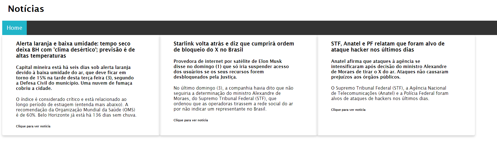
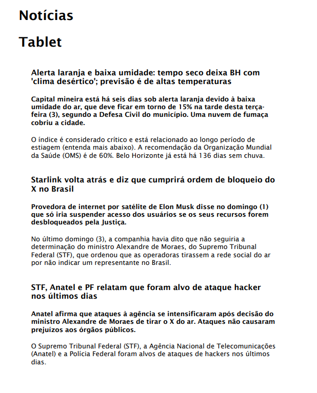
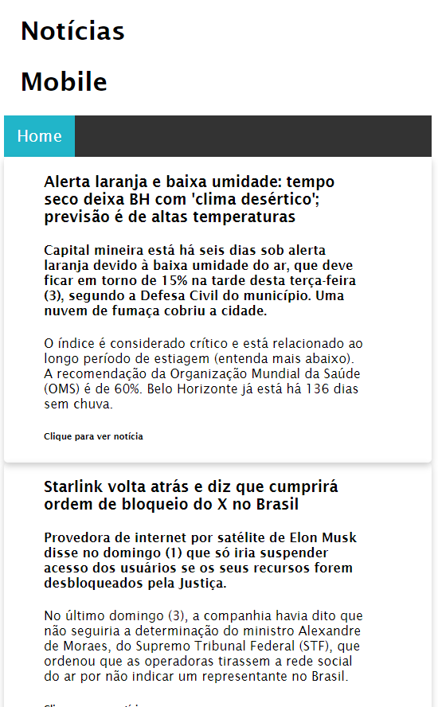
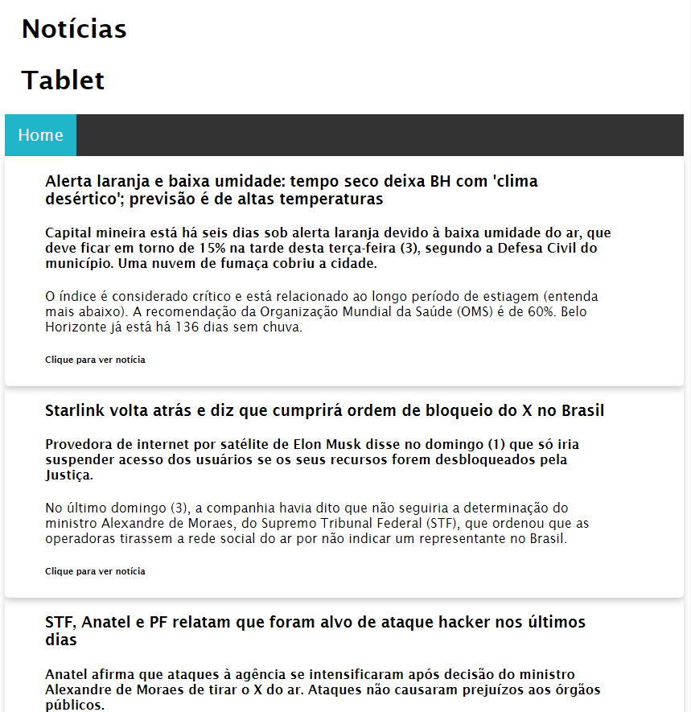

# POC 3: Media Queries
### Um código que demonstra propriedades principais de media queries em CSS.
Print - apenas impressão
Larguras de dispositivos diferentes (smartphone, tablet e desktop)
Disposição dos dispositivos (landscape e portrait)

## Descrição
Este é um código simples HTML com CSS e JS que demonstra as propriedades principais de media query em CSS.

Media queries permitem aplicação de estilos diferentes de CSS dependendo do estilo de media do dispositivo acessando o website.

### print

A media query de "print only" permite estilizar o site para determinar como seu CSS estará quando a página for impressa.

Isto permite a remoção de detalhes desnecessários e mudanças para facilitar leitura e observação do conteúdo.

> @media print

No site de notícias deste repositório, o CSS para impressão remove a barra de navegação, as sombras decorativas, o link de acesso e organiza as notícias em coluna para facilidade de leitura.

Antes:

Depois:

### max-width

A media query de "max width" permite estilizar o site dependendo da largura do dispositivo.

Isto permite diferenciar o site para desktop, tablet ou mobile.

> @media (max-width: 600px)

No site de notícias deste repositório, o CSS para mobile demonstra um título a mais, a organização das notícias em coluna, o controle de largura dos cards e ajuste do tamanho de imagens para a tela.

Antes:

Depois:

> @media (max-width: 900px) and (width > 600px)

No caso de acesso por tablet, o CSS adiciona tratamento de flex wrap para os cards de notícia, garantindo que permaneçam na tela. A organização é similar à de mobile.

### orientation

A media query de "orientation" permite estilizar o site dependendo da orientação do dispositivo.

No site de notícias deste repositório, o CSS para diferentes orientações foi incluso nas organizações para mobile e tablet.

> @media (max-width: 600px) and (orientation: portrait)

> @media (max-width: 900px) and (width > 600px) and (orientation: portrait)

## Linguagem
Este projeto utiliza um arquivo em HTML (index.html), um arquivo em CSS (style.css) e um arquivo em JavaScript (script.js). No repositório está também este arquivo explicativo em Markdown (README.md).

## Design
O design do arquivo é simples para garantir que seja fácil de abrir e executar, e para fácil compreensão e demonstração dos itens relevantes. 

## Como executar
Para executar este código, utilize a opção do Github que permite baixar o repositório em um arquivo compactado .zip.

[Imagem mostrando onde está o botão](https://prnt.sc/w8KYZsB4wUDH)

Quando o arquivo estiver baixado, extraia seu conteúdo em uma nova pasta ou uma pasta vazia. Confira que todos os itens do repositório estão na pasta com o arquivo principal (index.html, style.css e script.js).

*Extrair o arquivo em uma pasta vazia ou nova garante que nenhum arquivo exterior irá impedir a execução do código ou atrapalhar seu funcionamento*

Finalmente, abra o arquivo __index.html__ em um navegador como Edge ou Chrome. Se os passos anteriores foram seguidos corretamente, a página irá abrir no navegador selecionado.
